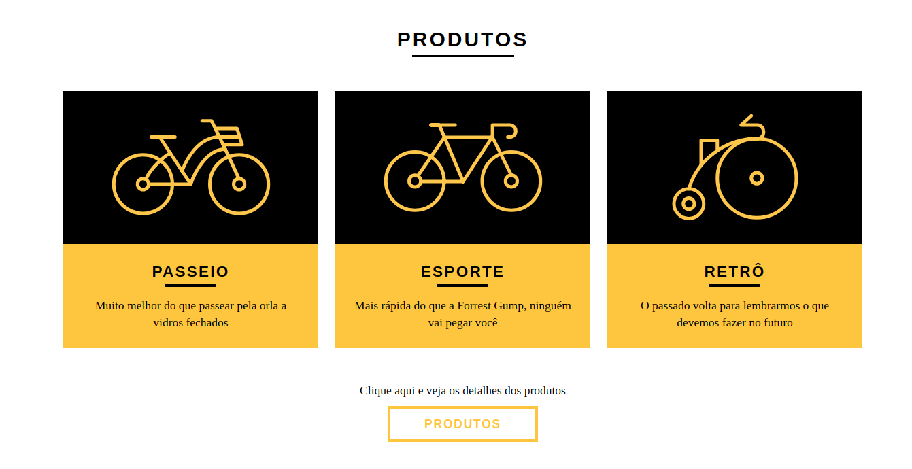

<h1 align="center">
   
    
   
   
  Bikcraft
</h1>

Bikcraft - Site responsivo construído com HTML5, CSS3 e JavaScript sem adição de framework. 

  

## 
   
 

## 
  

 

## 
  

 
  
## 
  

## 
  

## Features

   HTML5 
 

    CSS3
 

   JavaScript
 

## License

This project is licensed under the MIT License - see the [LICENSE](https://opensource.org/licenses/MIT) page for details.

